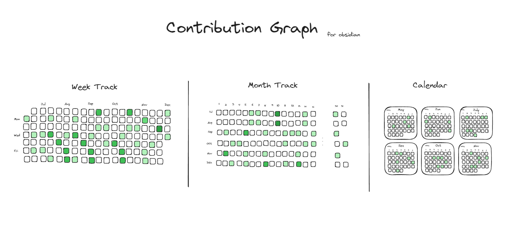
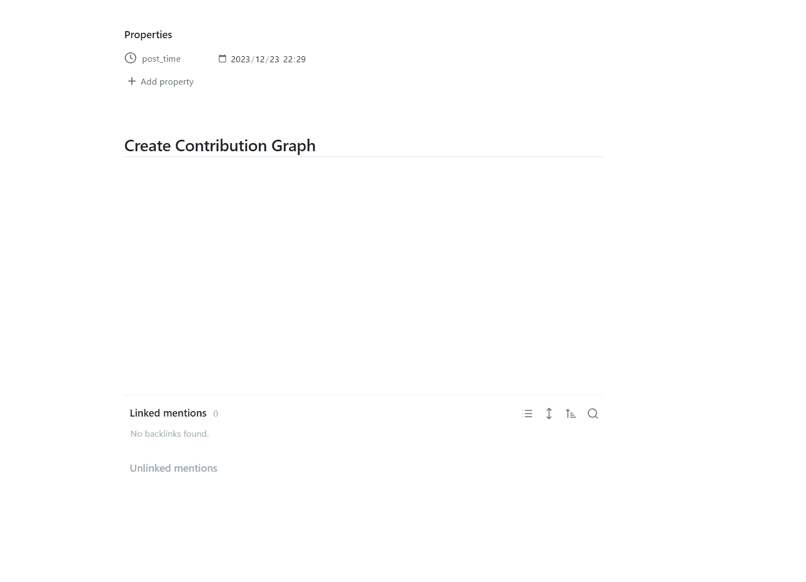
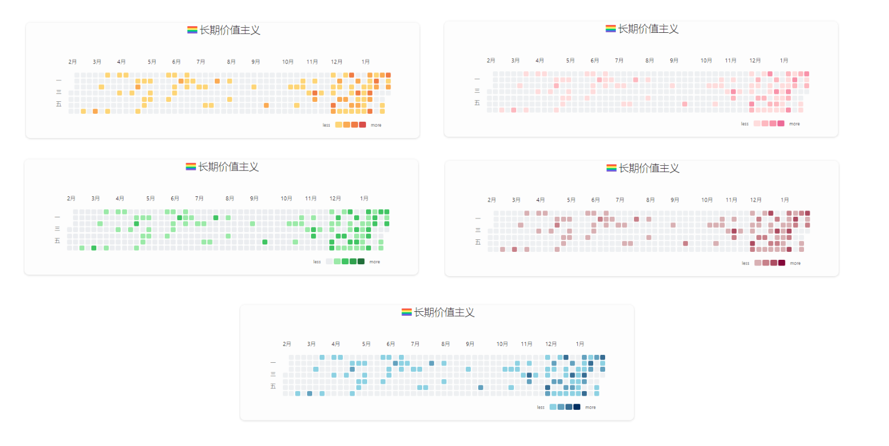
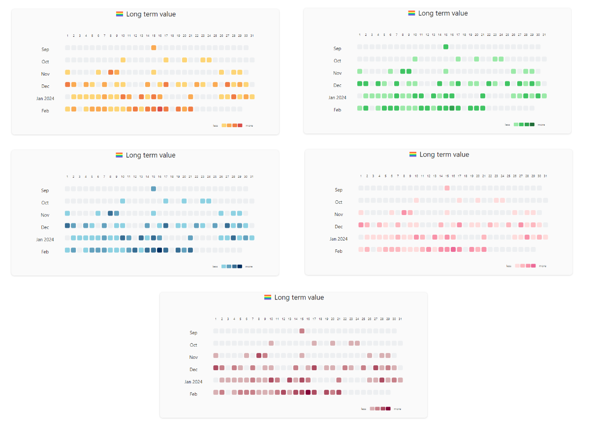
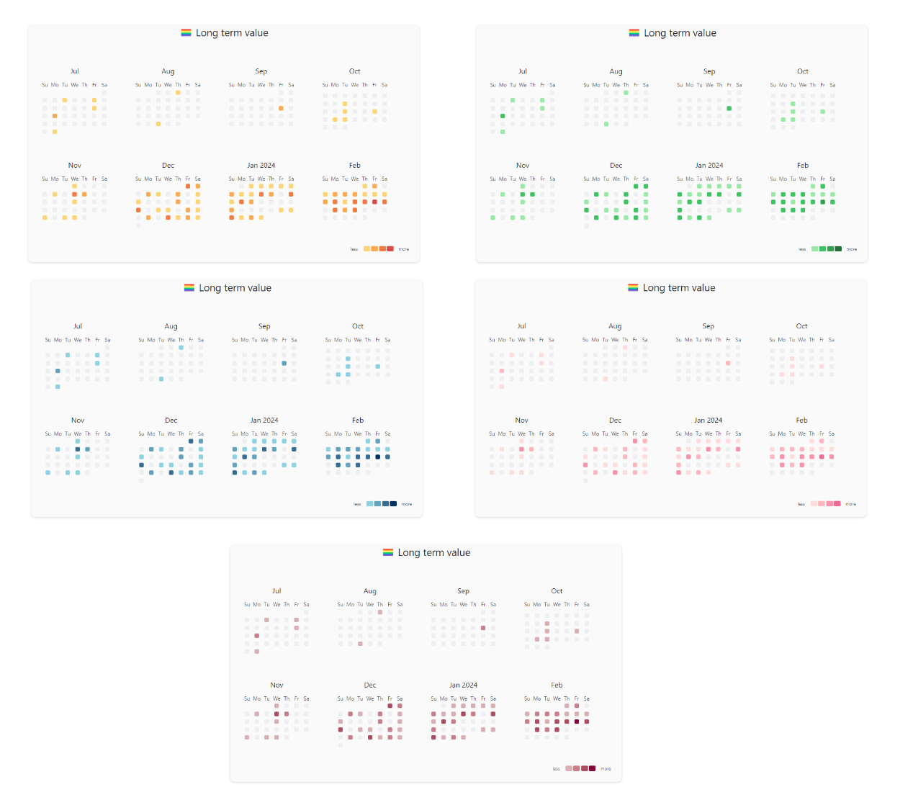
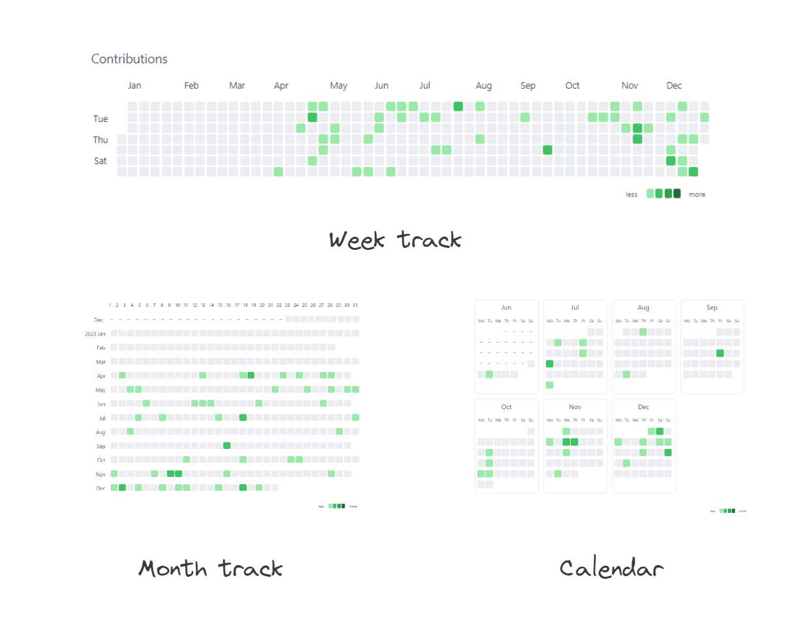
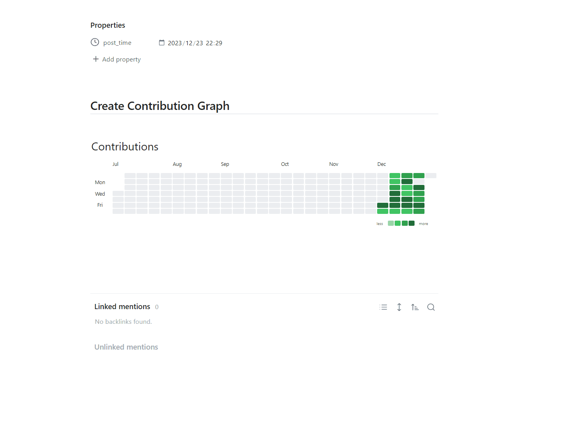

**English**  |  [中文文档](https://mp.weixin.qq.com/s/wI8M_C87oZAtCBjFWC8CmA)

## What

Contribution Graph is a plugin for [obsidian.md](https://obsidian.md/) which could generate interactive heatmap graphs like GitHub to track your notes, habits, activity, history, and so on.

## Use cases

- Habit Tracker: Count the number of tasks you complete every day. Different numbers will be marked in different colors.
- Note Tracker: Count the number of note you create every day. Different numbers will be marked in different colors.
- Review Report: Count your notes or tasks for a certain period of time and generate a heat map for a more intuitive review
- and more...

## Quick Start

- create empty note, then right-click
- select **Add Heatmap** options
- click the `save` button, and then a heatmap will be created in note.

## Theme

- Git Style

- Month Track

- Calendar

## Features

- diverse views, support week-track(default), month-track, and calendar view.
- personalized style, you can configure different cell colors and fill cells with emojis.
- use fixed date range or latest date to generate graph
- interactive charts, you can customize cell click event, hover to show statistic data
- simply integrate with DataviewJS, use contribution graph's api to dynamically render charts 

### How to modify graph?

Jut click the edit button at top right corner

### Configurations

| name                   | description                                                           | type                    | default    | sample     | required                                 |
| ---------------------- | --------------------------------------------------------------------- | ----------------------- | ---------- | ---------- | ---------------------------------------- |
| title                  | the title of the graph                                                | string                  | Contributions         |            | false                                    |
| titleStyle             | the style of the title                                                | object                  |          |            |   false                                       |
| days                   | Maximum number of days for the chart to display (starting from today) | number                  |            | 365        | true if miss **fromDate** and **toDate** |
| fromDate               | The start date of the chart                                           | date, format yyyy-MM-dd |            | 2023-01-01 | true if miss **days**                    |
| toDate                 | The end date of the chart                                             | date, format yyyy-MM-dd |            | 2023-12-31 | true if miss **days**                    |
| query                  | dataview query syntax, contribution graph will use it to count files  | string                  |            |            | true                                     |
| dateField              | Date attributes of files used for data distribution                   | string                  | file.ctime | createTime | false                                    |
| startOfWeek            | start of week                                                         | number                  | 0          |            | false                                    |
| showCellRuleIndicators | Control the display and hiding of cell rule indicator elements        | boolean                 | true       |            | false                                    |
| cellStyleRules         | cell style rule                                                       | array                   |            |            | false                                    |

## More Usage Guid

- [API Usage, Integrate with DataviewJS ](README_ADVANCE.md)
- [Codeblock Usage](README_BASE.md)
