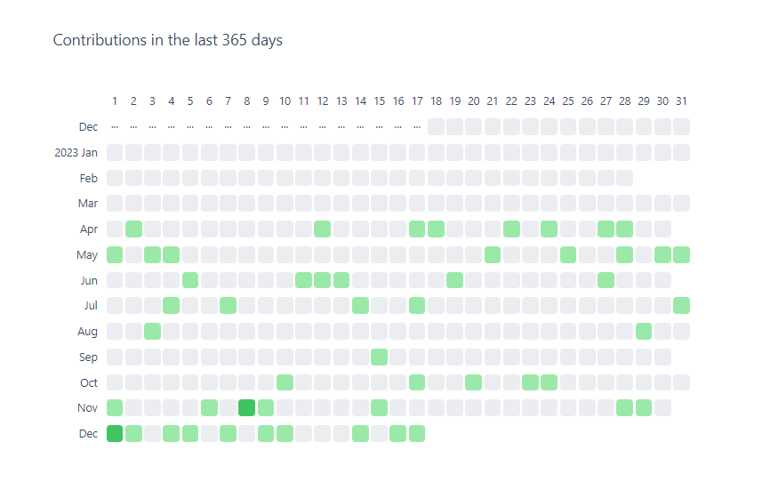

A interactive contribution graph like github to track your notes, habits, activity, history and so on.

## Features

- Render fixed date range chart
- Render recent date range chart
- Customize start of weekday
- Customize cell style
- Interactive charts, you can customize cell click event, hover to show statistic data
- support week track graph(default) and month track graph
- Integrate with DataviewJS

## Quick start

Currently, the contribution graph needs to be integrated with dataview (make sure you have the dataview plugin installed).

1. create `dataviewjs` codeblock

\`\`\`dataview

// to render chart here

\`\`\`

2. just use `renderContributionGraph` to render charts in `dataviewjs` codeblock


```markdown

const data = [
	{
		date: '2023-12-01' // format as yyyy-MM-dd
		value: 1 // count value
	},
	{
		date: '2023-12-02'
		value: 2
	},
	{
		date: '2023-12-03'
		value: 3
	}
]

const options = {
    title:  `${from} to ${to}`, // graph title
    data: data, // graph data
    fromDate: "2023-01-01", // chart from date, yyyy-MM-dd
    toDate: "2023-12-31" // chart to date, yyyy-MM-dd
		startOfWeek: 0 // valid from 0~6,represents sunday to saturday, this field only work when graphType is `default`
		graphType: "default" // `default` to render week-track graph, `month-track` to render month-track graph
}
renderContributionGraph(this.container, options)
```


## The Sample of Week Track Graph 

The following shows how to render charts using dataviewjs

### Create a week track graph for a fixed time period

- week track graph for fixed year

```dataviewjs
const from = '2022-01-01'
const to = '2022-12-31'
const data = [
	{
		date: '2022-01-01', // yyyy-MM-dd
		value: 1
	},
	{
		date: '2022-02-01', // yyyy-MM-dd
		value: 2
	},
	{
		date: '2022-03-01', // yyyy-MM-dd
		value: 3
	},
	{
		date: '2022-04-01', // yyyy-MM-dd
		value: 4
	},
	{
		date: '2022-05-01', // yyyy-MM-dd
		value: 5
	}
]

const calendarData = {
    title:  `${from} to ${to}`, // graph title
    data: data, // data
    fromDate: from, // from date, yyyy-MM-dd
    toDate: to // to date, yyyy-MM-dd
}
renderContributionGraph(this.container, calendarData)
```


- week track graph for current year

```dataviewjs
const currentYear = new Date().getFullYear()
const from = currentYear + '-01-01'
const to = currentYear + '-12-31'
const data = dv.pages('#project')
	.map(p => {
		return {
			date: p.createTime.toFormat('yyyy-MM-dd'),
			value: p
		}
	})
	.groupBy(p => p.date)
	.map(entry =>{
		return {
			date: entry.key,
			value: entry.rows.length
		}
	})

const calendarData = {
    title:  `${from} to ${to}`,
    data: data,
    fromDate: from,
    toDate: to
}
renderContributionGraph(this.container, calendarData)
```


- week track graph for current month

```dataviewjs
const currentYear = new Date().getFullYear()
const month = new Date().getMonth()// 0~11
const nextMonth = month + 1
const lastDayOfCurrentMonth = new Date(currentYear, nextMonth, 0).getDate()
const formattedLastDayOfCurrentMonth = lastDayOfCurrentMonth < 10 ? '0'+lastDayOfCurrentMonth:lastDayOfCurrentMonth
const formattedMonth = month < 9 ? '0' + (month+1): '' + (month+1)
const from = `${currentYear}-${formattedMonth}-01'`
const to = `${currentYear}-${formattedMonth}-${formattedLastDayOfCurrentMonth}'`

const data = []

const calendarData = {
    title:  `${from} to ${to}`,
    data: data,
    fromDate: from,
    toDate: to
}
renderContributionGraph(this.container, calendarData)
```


- week track graph for current week

```dataviewjs

function formatDateString(date) {
  var year = date.getFullYear();
  var month = String(date.getMonth() + 1).padStart(2, '0');
  var day = String(date.getDate()).padStart(2, '0');
  return year + '-' + month + '-' + day;
}

function getStartAndEndOfWeek() {
  var currentDate = new Date();
  var currentDayOfWeek = currentDate.getDay();
  var diffToStartOfWeek = currentDayOfWeek === 0 ? 6 : currentDayOfWeek - 1;
  var startOfWeek = new Date(currentDate.getFullYear(), currentDate.getMonth(), currentDate.getDate() - diffToStartOfWeek);
  var endOfWeek = new Date(startOfWeek.getFullYear(), startOfWeek.getMonth(), startOfWeek.getDate() + 6);
  
  var formattedStart = formatDateString(startOfWeek);
  var formattedEnd = formatDateString(endOfWeek);
  
  return {
    start: formattedStart,
    end: formattedEnd
  };
}

const data = []
const weekDate = getStartAndEndOfWeek()
const from = weekDate.start
const to = weekDate.end

const calendarData = {
    title:  `${from} to ${to}`,
    data: data,
    fromDate: from,
    toDate: to
}
renderContributionGraph(this.container, calendarData)

```


### Create a week track graph at recent time periods

fixed dates, you can also use the days attribute to generate a chart of recent dates

- week track graph in the lastest 365 days

```dataviewjs
const data = dv.pages('#project')
	.map(p => {
		return {
			date: p.createTime.toFormat('yyyy-MM-dd'),
			value: p
		}
	})
	.groupBy(p => p.date)
	.map(entry =>{
		return {
			date: entry.key,
			value: entry.rows.length
		}
	})
const calendarData = {
    days: 365,
    title: 'Contributions in the last 365 days ',
    data: data
}
renderContributionGraph(this.container, calendarData)
```


### Begin with Monday

By default, the first row represents Sunday, you can change it by configuring `startOfWeek`, the allowable values is 0~6

```dataviewjs
const currentYear = new Date().getFullYear()
const from = currentYear + '-01-01'
const to = currentYear + '-12-31'
const data = []

const calendarData = {
    title:  `${from} to ${to}`,
    data: data,
    fromDate: from,
    toDate: to,
    startOfWeek: 1 // set to 1 means start with monday
}
renderContributionGraph(this.container, calendarData)
```


### Customize cell click event

By configuring the oncellclick attribute, you can set the cell click behavior you want.

The following shows an example of automatically performing a keyword search after clicking on a cell.

```dataviewjs
const data = dv.pages('#project')
	.map(p => {
		return {
			date: p.createTime.toFormat('yyyy-MM-dd'),
			value: p
		}
	})
	.groupBy(p => p.date)
	.map(entry =>{
		return {
			date: entry.key,
			value: entry.rows.length
		}
	})
const calendarData = {
    days: 365,
    title: 'Contributions in the last 365 days ',
    data: data,
    onCellClick: (item) => {
	    // generate search key
	    const key = `["tags":project] ["createTime":${item.date}]`
	    // use global-search plugin to search data
		app.internalPlugins.plugins['global-search'].instance.openGlobalSearch(key)
    },
}
renderContributionGraph(this.container, calendarData)
```


### Customize Cells

By configuring the cellStyleRules attribute, you can customize the cell's background color or inner text

if the number of contributions at a specified date is larger or equal to `min`, less than `max`, then the `rule` will be matched

> min <= {contributions} < max

| name  | type   | description |
| ----- | ------ | ----------- |
| color | string | hex color   |
| min   |  number      | the min contribution            |
| max   |  number      | the max contribution            |

- customize background color

```dataviewjs
const data = dv.pages('#project')
	.map(p => {
		return {
			date: p.createTime.toFormat('yyyy-MM-dd'),
			value: p
		}
	})
	.groupBy(p => p.date)
	.map(entry =>{
		return {
			date: entry.key,
			value: entry.rows.length
		}
	})
const calendarData = {
    days: 365,
    title: 'Contributions in the last 365 days ',
    data: data,
    onCellClick: (item) => {
	    const key = `["tags":project] ["createTime":${item.date}]`
		app.internalPlugins.plugins['global-search'].instance.openGlobalSearch(key)
    },
    cellStyleRules: [
		{
			color: "#FFF8DC",
			min: 1,
			max: 2,
		},
		{
			color: "#FFECB3",
			min: 2,
			max: 3,
		},
		{
			color: "#FFD700",
			min: 3,
			max: 4,
		},
		{
			color: "#FFC200",
			min: 4,
			max: 999,
		},
	]
}
renderContributionGraph(this.container, calendarData)

```


- customize inner text

```dataviewjs
const data = dv.pages('#project')
	.flatMap(p => {
		const arr = []
		if (p.doneTime) {
			arr.push({
				date: p.doneTime.toFormat('yyyy-MM-dd'),
				value: p,
				group: 'done'
			})
		} 
		if (p.createTime) {
			arr.push({
				date: p.createTime.toFormat('yyyy-MM-dd'),
				value: p,
				group: 'created'
			})
		}
		if(!p.createTime && !p.doneTime) {
			console.warn(`project ${p.file.name} missing createTime or doneTime field`)
		}
		return arr
	})
	.groupBy(p => p.date)
	.map(entry =>{
		const doneGroupCount = entry.rows.filter(i => i.group == 'done').length
		const createdGroupCount = entry.rows.filter(i => i.group == 'created').length
		return {
			date: entry.key,
			value: entry.rows.length,
			summary: `create ${createdGroupCount} and done ${doneGroupCount} projects at ${entry.key}`
		}
	})
const calendarData = {
    days: 365,
    title: 'Contributions in the last 365 days ',
    data: data,
    onCellClick: (item) => {
	    const key = `["tags":project] ["createTime":${item.date}]`
		app.internalPlugins.plugins['global-search'].instance.openGlobalSearch(key)
    },
    cellStyleRules: [
	    {
		    min: 1,
		    max: 2,
		    text: '🌲'
	    },
	    {
		    min: 2,
		    max: 3,
		    text: '😥'
	    },
	    {
		    min: 3,
		    max: 4,
		    text: '✈'
	    },
	    {
		    min: 4,
		    max: 99,
		    text: '✈'
	    }
    ]
}
renderContributionGraph(this.container, calendarData)
```


## Use Month Track Graph 

In addition to the weekly tracking chart (the default), you can also generate a monthly tracking chart.

In a monthly tracking chart, each row represents the date of an entire month, like this



Configuration is very simple, just set the graphType to month-track and you're good to go!

```dataviewjs
const from = '2022-01-01'
const to = '2022-12-31'
const fromDate = new Date(from)
const toDate = new Date(to)
const data = []

const calendarData = {
    title:  `Contributions from ${from} to ${to}`,
    data: data,
    days: 365,
    fromDate: from,
    toDate: to,
    graphType: "month-track" // set this field value as 'month-track'
}
renderContributionGraph(this.container, calendarData)
```

## Full Render Configuration

```js
export class ContributionGraphConfig {
	/**
	 * the title of the graph
	 */
	title = "Contribution Graph";
	/**
	 * recent days to show
	 */
	days?: number | undefined;
	/**
	 * the start date of the graph，if `days` is set, this value will be ignored
	 */
	fromDate?: Date | string | undefined;
	/**
	 * the end date of the graph，if `days` is set, this value will be ignored
	 */
	toDate?: Date | string | undefined;
	/**
	 * the data to show at cell
	 */
	data: Contribution[];
	/**
	 * the rules to style the cell
	 */
	cellStyleRules: CellStyleRule[] = DEFAULT_RULES;
	/**
	 * `default`: every column is a week day from top to bottom
	 * `month-track`: every row is a month from left to right
	 *
	 * default value: `default`
	 */
	graphType: "default" | "month-track" = "default";
	/**
	 * value range: 0->Sunday, 1->Monday, 2->Tuesday, 3->Wednesday, 4->Thursday, 5->Friday, 6->Saturday
	 * default value: 0
	 * notice: it's only work when `graphType` is `Weekday`
	 */
	startOfWeek: 0 | 1 | 2 | 3 | 4 | 5 | 6 = 0;
	/**
	 * callback when cell is clicked
	 */
	onCellClick?: (
		cellData: ContributionCellData,
		event: MouseEvent | undefined
	) => void | undefined;
}

export interface Contribution {
	/**
	 * the date of the contribution, format: yyyy-MM-dd
	 */
	date: string;
	/**
	 * the value of the contribution
	 */
	value: number;
	/**
	 * the summary of the contribution, will be shown when hover on the cell
	 */
	summary: string | undefined;
}

export interface CellStyleRule {
	// the background color for the cell
	color: string;
	// the text in the cell
	text?: string | undefined;
	// the inlusive min value
	min: number;
	// the exclusive max value
	max: number;
}

```