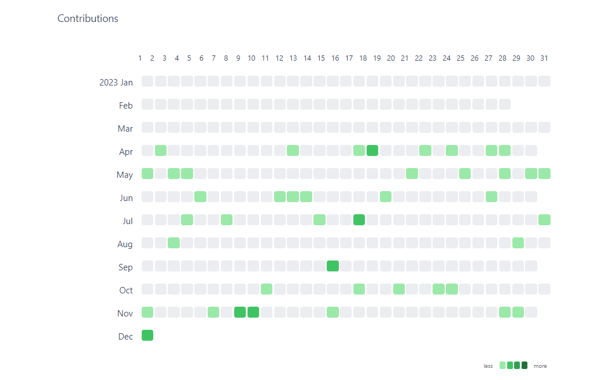
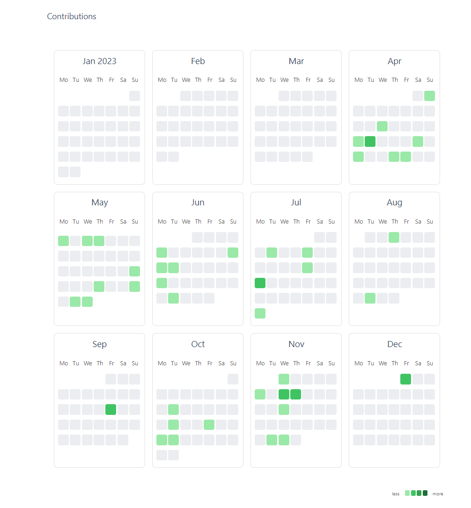

## What

Contribution Graph is a plugin for [obsidin.md](https://obsidian.md/)which could generate interactive contribution graphs like GitHub to track your notes, habits, activity, history, and so on.


[](https://www.buymeacoffee.com/vran)


## Quick Start

Simply create a `contributionGrph` codeblock, then paste the following code into it

```yaml
title: "Contributions on the latest 365 days"
days: 365
query: '""' # dataview query, "" means query all files in obsidian
```


Then you'll see magic happened


## Features

- diverse views, support week-track(default), month-track, and calendar view.
- personalized style, you can configure different cell colors and fill cells with emojis.
- use fixed date range or latest date to generate graph
- interactive charts, you can customize cell click event, hover to show statistic data
- simply integrate with DataviewJS, use contribution graph's api to dynamically render charts 


## Showcase

> if you are interested in dataviewJS integration, see [here](README_ADVANCE.md)

Please note two points

- All configuration is placed within the `contributionGraph` **codeblock**
- Configuration is essentially using the [yaml](https://yaml.org/) format


### Simple usage

Generate a chart based on files containing the `project` tag created in the last 365 days


```yaml
title: 'Contributions'  # the title of the contribution
days: 365
query: '#project' # list all fils which contains `project` tag
```

Some specific cases of **query**

- `'archive'`:  all files in `archive` folder
- `'#food and !#fastfood'`: pages that contain `#food` but does not contain `#fastfood`.
- `'#tag and "folder"'`: pages in `folder` and with `#tag`.

see [dataview document](https://blacksmithgu.github.io/obsidian-dataview/reference/sources/#combining-sources)  to learn more.

### Fixed date range

according to configure `fromDate` and `toDate`, you can generate fixed date range charts


```yaml
title: 'Contributions'  # the title of the contribution
fromDate: '2023-01-01' # date format must be yyyy-MM-dd
toDate: '2023-12-01'
query: '#project' # list all fils which contains `project` tag
```

### Customize Date Field

By default, contribution charts are generated based on the creation time of the file (`file.ctime`).

But many times you will want to generate charts based on the custom date attributes of the file, such as `createTime` or `doneTime` in the **fonrtmatter**.

faced with this requirement, Just set the dateField to the value you want


```yaml
title: 'Contributions'  # the title of the contribution
fromDate: '2023-01-01' # date format must be yyyy-MM-dd
toDate: '2023-12-01'
dateField: 'createTime' # use customized field to genrate charts
query: '#project' # list all fils which contains `project` tag
```
### Start Of Week

default, charts start with sunday at first row, You can change this by setting `startOfWeek`(only work in week-track and calendar view).

Supported values are 0~6, representing Sunday, Monday to Saturday respectively.


```yaml
title: 'Contributions'  # the title of the contribution
fromDate: '2023-01-01' # date format must be yyyy-MM-dd
toDate: '2023-12-01'
startOfWeek: 1 # start with monday 
dateField: 'createTime' # use customized field to genrate charts
query: '#project' # list all fils which contains `project` tag
```

### Month Track View and Calendar View

default view type is week-track, github style charts. You can change this by setting `graphType`

- change it to **month-track** view



```yaml
title: 'Contributions'  # the title of the contribution
fromDate: '2023-01-01' # date format must be yyyy-MM-dd
toDate: '2023-12-01'
startOfWeek: 1 # start with monday 
dateField: 'createTime' # use customized field to genrate charts
query: '#project' # list all fils which contains `project` tag
graphType: 'month-track'
```

- change it to **calendar** view




```yaml
title: 'Contributions'  # the title of the contribution
fromDate: '2023-01-01' # date format must be yyyy-MM-dd
toDate: '2023-12-01'
startOfWeek: 1 # start with monday 
dateField: 'createTime' # use customized field to genrate charts
query: '#project' # list all fils which contains `project` tag
graphType: 'calendar'
```
### Personized cell color

You can customize your contribution graph by setting cellStyleRules, like this


```yaml
title: 'Contributions'  # the title of the contribution
fromDate: '2023-01-01' # date format must be yyyy-MM-dd
toDate: '2023-12-01'
startOfWeek: 1 # start with monday 
dateField: 'createTime' # use customized field to genrate charts
query: '#project' # list all fils which contains `project` tag
graphType: 'calendar'
cellStyleRules: # personized your graph style
  - color: '#f1d0b4'
    min: 1
    max: 2
  - color: '#e6a875'
    min: 2
    max: 3
  - color: '#d97d31'
    min: 3
    max: 4
  - color: '#b75d13'
    min: 4
    max: 999
```

### Personized cell text

In addition to colors, you can also personalize your charts using emoji or text


```yaml
title: 'Contributions'  # the title of the contribution
fromDate: '2023-01-01' # date format must be yyyy-MM-dd
toDate: '2023-12-01'
startOfWeek: 1 # start with monday 
dateField: 'createTime' # use customized field to genrate charts
query: '#project' # list all fils which contains `project` tag
graphType: 'default'
cellStyleRules: # personized your graph style
  - text: '✅'
    min: 1
    max: 2
  - text: '🌳'
    min: 2
    max: 3
  - text: '🚩'
    min: 3
    max: 4
  - text: '🚀'
    min: 4
    max: 999
```

### Hide cell rule indicators

If you don't like the cell indicators in the lower right corner, you can set `showCellRuleIndicators` to false to hide it.


```yaml
title: 'Contributions'  # the title of the contribution
fromDate: '2023-01-01' # date format must be yyyy-MM-dd
toDate: '2023-12-01'
startOfWeek: 1 # start with monday 
dateField: 'createTime' # use customized field to genrate charts
query: '#project' # list all fils which contains `project` tag
graphType: 'default'
showCellRuleIndicators: false
```

## Full Codeblock Configuration

| name                   | description                                                           | type                    | default    | sample     | required                                 |
| ---------------------- | --------------------------------------------------------------------- | ----------------------- | ---------- | ---------- | ---------------------------------------- |
| title                  | the title of the graph                                                | string                  | ''         |            | false                                    |
| days                   | Maximum number of days for the chart to display (starting from today) | number                  |            | 365        | true if miss **fromDate** and **toDate** |
| fromDate               | The start date of the chart                                           | date, format yyyy-MM-dd |            | 2023-01-01 | true if miss **days**                    |
| toDate                 | The end date of the chart                                             | date, format yyyy-MM-dd |            | 2023-12-31 | true if miss **days**                    |
| query                  | dataview query syntax, contribution graph will use it to count files  | string                  |            |            | true                                     |
| dateField              | Date attributes of files used for data distribution                   | string                  | file.ctime | createTime | false                                    |
| startOfWeek            | start of week                                                         | number                  | 0          |            | false                                    |
| showCellRuleIndicators | Control the display and hiding of cell rule indicator elements        | boolean                 | true       |            | false                                    |
| cellStyleRules         | cell style rule                                                       | array                   |            |            | false                                    |

## Integrate with Dataview

If you are familiar with javascript, you can use the contribution Graph API through dataviewJS, To access more advanced features.

contribution Graph Exposed a global function named `renderContributionGraph`, It is defined as follows.

> if you want to see more api's usage case, see [adanced](README_ADVANCE.md) page. 

```js
function renderContributionGraph(container: HTMLElement, config: ContributionGraphConfig): void
```

```js
export class ContributionGraphConfig {
	/**
	 * the title of the graph
	 */
	title = "Contribution Graph";

	/**
	 * recent days to show
	 */
	days?: number | undefined;

	/**
	 * the start date of the graph，if `days` is set, this value will be ignored
	 */
	fromDate?: Date | string | undefined;

	/**
	 * the end date of the graph，if `days` is set, this value will be ignored
	 */
	toDate?: Date | string | undefined;

	/**
	 * the data to show at cell
	 */
	data: Contribution[];

	/**
	 * the rules to style the cell
	 */
	cellStyleRules: CellStyleRule[] = DEFAULT_RULES;

	/**
	 * set false to hide rule indicators
	 */
	showCellRuleIndicators = true;

	/**
	 * `default`: every column is a week day from top to bottom
	 * `month-track`: every row is a month from left to right
	 *
	 * default value: `default`
	 */
	graphType: "default" | "month-track" | "calendar" = "default";

	/**
	 * value range: 0->Sunday, 1->Monday, 2->Tuesday, 3->Wednesday, 4->Thursday, 5->Friday, 6->Saturday
	 * default value: 0
	 * notice: it's not work when `graphType` is `month-track`
	 */
	startOfWeek: 0 | 1 | 2 | 3 | 4 | 5 | 6 = 0;

	/**
	 * callback when cell is clicked
	 */
	onCellClick?: (
		cellData: ContributionCellData,
		event: MouseEvent | undefined
	) => void | undefined;
}

export interface Contribution {
	/**
	 * the date of the contribution, format: yyyy-MM-dd
	 */
	date: string | Date;
	/**
	 * the value of the contribution
	 */
	value: number;
	/**
	 * the summary of the contribution, will be shown when hover on the cell
	 */
	summary: string | undefined;
}

export interface CellStyleRule {
	// the background color for the cell
	color: string;
	// the text in the cell
	text?: string | undefined;
	// the inlusive min value
	min: number;
	// the exclusive max value
	max: number;
}
```
