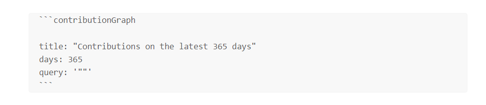

## Showcase

> If you are interested in dataviewJS integration, see [here](README_ADVANCED.md)

Please note two points

- All configuration is placed within the `contributionGraph` **codeblock**
- Configuration is essentially using the [yaml](https://yaml.org/) format



### Simple Usage

Generate a chart based on files containing the `project` tag created in the last 365 days


```yaml
title: 'Contributions'  # the title of the contribution
days: 365
query: '#project' # list all fils which contains `project` tag
```

Basic **Query** Examples

- `'archive'`:  all files in `archive` folder
- `'#food and !#fastfood'`: pages that contain `#food` but does not contain `#fastfood`.
- `'#tag and "folder"'`: pages in `folder` and with `#tag`.

see [dataview documentation](https://blacksmithgu.github.io/obsidian-dataview/reference/sources/#combining-sources) to learn more.

## Fixed date range

You can generate fixed date range charts by configuring `fromDate` and `toDate`, 


```yaml
title: 'Contributions'  # the title of the contribution
fromDate: '2023-01-01' # date format must be yyyy-MM-dd
toDate: '2023-12-01'
query: '#project' # list all fils which contains `project` tag
```

### Customize Date Field

By default, contribution charts are generated based on the creation time of the file (`file.ctime`).

If you want you to generate charts based on the custom date attributes of the file, such as `createTime` or `doneTime` in the **frontmatter**, just set the dateField to the field you want, see example below.


```yaml
title: 'Contributions'  # the title of the contribution
fromDate: '2023-01-01' # date format must be yyyy-MM-dd
toDate: '2023-12-01'
dateField: 'createTime' # use customized field to genrate charts
query: '#project' # list all fils which contains `project` tag
```
### Start Of Week

As default, charts start with sunday as the first day of the week. You can change this by changing `startOfWeek`(only work in week-track and calendar view).

Supported values are 0~6, representing Sunday, Monday to Saturday respectively.


```yaml
title: 'Contributions'  # the title of the contribution
fromDate: '2023-01-01' # date format must be yyyy-MM-dd
toDate: '2023-12-01'
startOfWeek: 1 # start with monday 
dateField: 'createTime' # use customized field to genrate charts
query: '#project' # list all fils which contains `project` tag
```

### Month Track View and Calendar View

Default view type is week-track, github style charts. You can change the graph type by changing `graphType`

- **month-track**


```yaml
title: 'Contributions'  # the title of the contribution
fromDate: '2023-01-01' # date format must be yyyy-MM-dd
toDate: '2023-12-01'
startOfWeek: 1 # start with monday 
dateField: 'createTime' # use customized field to genrate charts
query: '#project' # list all fils which contains `project` tag
graphType: 'month-track'
```

- **calendar**


```yaml
title: 'Contributions'  # the title of the contribution
fromDate: '2023-01-01' # date format must be yyyy-MM-dd
toDate: '2023-12-01'
startOfWeek: 1 # start with monday 
dateField: 'createTime' # use customized field to genrate charts
query: '#project' # list all fils which contains `project` tag
graphType: 'calendar'
```
### Customize Cell Color

You can customize your contribution graph by setting cellStyleRules, like this


```yaml
title: 'Contributions'  # the title of the contribution
fromDate: '2023-01-01' # date format must be yyyy-MM-dd
toDate: '2023-12-01'
startOfWeek: 1 # start with monday 
dateField: 'createTime' # use customized field to genrate charts
query: '#project' # list all fils which contains `project` tag
graphType: 'calendar'
cellStyleRules: # personized your graph style
  - color: '#f1d0b4'
    min: 1
    max: 2
  - color: '#e6a875'
    min: 2
    max: 3
  - color: '#d97d31'
    min: 3
    max: 4
  - color: '#b75d13'
    min: 4
    max: 999
```

### Customize Cell Text

In addition to colors, you can also personalize your charts using emoji or text


```yaml
title: 'Contributions'  # the title of the contribution
fromDate: '2023-01-01' # date format must be yyyy-MM-dd
toDate: '2023-12-01'
startOfWeek: 1 # start with monday 
dateField: 'createTime' # use customized field to genrate charts
query: '#project' # list all fils which contains `project` tag
graphType: 'default'
cellStyleRules: # personized your graph style
  - text: '✅'
    min: 1
    max: 2
  - text: '🌳'
    min: 2
    max: 3
  - text: '🚩'
    min: 3
    max: 4
  - text: '🚀'
    min: 4
    max: 999
```

### Hide Cell Rule Indicators

If you don't like the cell indicators in the lower right corner, you can change `showCellRuleIndicators` to false to hide it.


```yaml
title: 'Contributions'  # the title of the contribution
fromDate: '2023-01-01' # date format must be yyyy-MM-dd
toDate: '2023-12-01'
startOfWeek: 1 # start with monday 
dateField: 'createTime' # use customized field to genrate charts
query: '#project' # list all fils which contains `project` tag
graphType: 'default'
showCellRuleIndicators: false
```

### Change Title Style 

You can customize your favorite title style by changing `titleStyle` field, it's support almost all css properties, such as

- textAlign
- backgroundColor
- color
- fontSize


```yaml
title: 'Customized Title Style'  # the title of the contribution
titleStyle:
  textAlign: 'center' # change to center, you can set left, right
  backgroundColor: 'transparent' 
  fontSize: '24px'
  color: 'Green' # font color
fromDate: '2023-01-01' # date format must be yyyy-MM-dd
toDate: '2023-12-01'
startOfWeek: 1 # start with monday 
dateField: 'createTime' # use customized field to genrate charts
query: '#project' # list all fils which contains `project` tag
graphType: 'default'
showCellRuleIndicators: false
```


## Full Codeblock Configuration

| name                   | description                                                           | type                    | default    | sample     | required                                 |
| ---------------------- | --------------------------------------------------------------------- | ----------------------- | ---------- | ---------- | ---------------------------------------- |
| title                  | The title of the graph                                                | string                  | ''         |            | false                                    |
| titleStyle             | The style of the title                                                | object                  |          |            |   false                                       |
| days                   | Maximum number of days for the chart to display (starting from today) | number                  |            | 365        | true if miss **fromDate** and **toDate** |
| fromDate               | The start date of the chart                                           | date, format yyyy-MM-dd |            | 2023-01-01 | true if miss **days**                    |
| toDate                 | The end date of the chart                                             | date, format yyyy-MM-dd |            | 2023-12-31 | true if miss **days**                    |
| query                  | Dataview query syntax, contribution graph will use it to count files  | string                  |            |            | true                                     |
| dateField              | Date attributes of files used for data distribution                   | string                  | file.ctime | createTime | false                                    |
| startOfWeek            | Start of week                                                         | number                  | 0          |            | false                                    |
| showCellRuleIndicators | Control the display and hiding of cell rule indicator elements        | boolean                 | true       |            | false                                    |
| cellStyleRules         | Cell style rule                                                       | array                   |            |            | false                                    |


## Integrate with Dataview

If you are familiar with javascript, you can use the contribution Graph API through dataviewJS to access more advanced features.

contribution Graph Exposed a global function named `renderContributionGraph`, It is defined as follows.


```js
function renderContributionGraph(container: HTMLElement, config: ContributionGraphConfig): void
```

If you want to see more api's, use cases, see [README_ADVANCED.md](README_ADVANCED.md). 